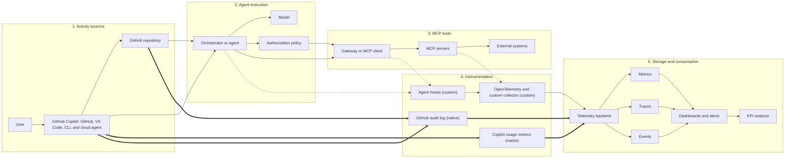

# Telemetry and KPI Design for Automated Agents and MCP Utilization

**Status:** Design proposal  
**Audience:** Product, platform, SRE, security, and engineering teams

## 1. Purpose

This document defines a telemetry model and KPI framework for measuring:

- Utilization of automated agents.
- MCP server and tool usage.
- Agent efficiency, quality, reliability, and cost.
- User and business outcomes rather than activity alone.

The design can be implemented behind a small telemetry adapter without coupling an application to a specific observability vendor.

> [“An SLI is a service level indicator—a carefully defined quantitative measure.”](https://sre.google/sre-book/service-level-objectives/)

## 2. Applicability to GitHub and GitHub Copilot

This guidance applies to GitHub and GitHub Copilot, but it must be implemented in two layers:

1. **GitHub-native or GitHub-derived telemetry:** adoption, active users, use of modes and agents, code generation, pull requests, agent sessions, and audit activity.
2. **Custom telemetry:** detailed traces, individual MCP calls, latency, retries, validations, cost per goal, and business quality.

GitHub provides Copilot usage metrics through dashboards, APIs, and NDJSON exports, with data on adoption, activity, code generation, and the pull request lifecycle. These metrics may be available at the enterprise, organization, repository, and user levels depending on the resource queried. [GitHub documentation describes the usage metrics API as the recommended option for new integrations and analysis.](https://docs.github.com/en/copilot/concepts/copilot-usage-metrics/copilot-metrics)

Native metrics should be interpreted as adoption and activity signals, not as a complete measure of quality or business value. For example, lines-of-code metrics are directional and do not by themselves demonstrate correctness, maintainability, or user success. [GitHub defines lines-of-code metrics as a directional measure of Copilot output.](https://docs.github.com/en/copilot/reference/copilot-usage-metrics/lines-of-code-metrics)

### 2.1 Availability classification

| Area | Availability in GitHub/Copilot | Recommended treatment |
|---|---|---|
| Active users and adoption | Native | Use Copilot metrics APIs, dashboards, or exports |
| Agent mode and cloud agent usage | Native/partial | Segment by mode, agent, repository, and period |
| Lines added/removed | Native | Use only as a directional indicator |
| Pull requests created, reviewed, and merged | Native/derived | Combine with checks, reviews, deployments, and reverts |
| Agent sessions, tokens, and duration | Native on supported surfaces | Use session logs for investigation and auditing |
| Administrative and agent activity | Native through the audit log | Correlate `agent_session_id` when available |
| Custom agent and MCP configuration | Native for supported surfaces | Restrict tools and record configuration changes |
| Individual MCP calls, duration, and retries | Should not be assumed native | Instrument the agent, the MCP server, or a custom observability layer |
| Complete OpenTelemetry traces | Depends on the surface | Confirm support for CLI, IDE, cloud agent, and custom servers before designing the integration |
| Cost per successful goal | Derived/custom | Combine consumption, internal pricing, and validated outcomes |
| Correctness, safety, and business outcome | Custom | Measure with tests, reviews, incidents, corrections, and acceptance criteria |

GitHub agent sessions allow reviewing progress, token usage, duration, and the tools used. [Session logs also make it possible to relate commits to the session that produced them.](https://docs.github.com/en/copilot/how-tos/copilot-on-github/use-copilot-agents/manage-and-track-agents)

Agentic activity can be queried in the audit log using filters such as `actor:Copilot`; events may include `agent_session_id`. [GitHub documents a 180-day query window for this activity in the enterprise audit log.](https://docs.github.com/en/enterprise-cloud%40latest/copilot/reference/agentic-audit-log-events)

### 2.2 Recommended data sources

| Source | Recommended use |
|---|---|
| Copilot usage metrics API | Adoption, active users, models, modes, agents, and activity by repository |
| Code generation dashboard | Changes initiated by users and agents |
| Copilot impact dashboard | Relationship between adoption and pull request outcomes |
| Agent session logs | Investigation of sessions, tools, tokens, and duration |
| Enterprise audit log | Agent activity and administrative events |
| Pull requests, checks, and deployments | Validation of quality, delivery, and operational outcomes |
| Agent hooks | Session events, prompts, tool calls, and results, where policy permits |
| OpenTelemetry or custom collector | Spans, MCP calls, latency, retries, cost, and business quality |

GitHub documents hooks for the cloud agent and Copilot CLI that can be used to record results, usage statistics, audits, and performance metrics. [Hooks should be designed with data minimization and privacy controls.](https://docs.github.com/en/copilot/concepts/agents/hooks)

## 3. Design principles

1. **Measure outcomes first.** Agent activity is not success. The primary measures are completed user goals, correctness, safety, latency, and cost.
2. **Use traces for causality.** One user request should produce one trace containing agent steps, model calls, MCP calls, retries, approvals, and the final result.
3. **Use metrics for aggregation.** Counters, histograms, and gauges should answer operational questions without querying raw events.
4. **Use logs/events for auditability.** Record structured events for investigations, replay, quality analysis, and compliance.
5. **Preserve privacy.** Do not emit prompts, tokens, account numbers, credentials, connection strings, or tool payloads by default. Use redaction, hashing, sampling, and access controls.
6. **Control cardinality.** Use bounded dimensions such as `agent_name`, `agent_version`, `environment`, `mcp_server`, `tool_name`, `outcome`, and `error_type`.
7. **Connect metrics to traces.** OpenTelemetry exemplars can associate metric values with trace context, enabling drill-down from a KPI to a representative execution.
8. **Distinguish availability from capability.** Mark each KPI as `github-native`, `github-derived`, or `custom-instrumentation`.
9. **Separate technical success from business success.** A completed commit, pull request, or deployment does not by itself prove that the user's goal was met.

## 4. Measurement model

### 4.1 Entity hierarchy

```text
User session or GitHub task
└── Agent run / trace
    ├── Planning step
    ├── Model invocation
    ├── MCP tool call
    │   ├── Request
    │   ├── Authorization / approval
    │   └── Result or error
    ├── Edit, commit, or pull request
    ├── Validation / recovery step
    └── Final response
```

### 4.2 Required identifiers

| Identifier | Purpose |
|---|---|
| `trace_id` | Correlates one end-to-end agent run |
| `span_id` | Identifies one operation within a trace |
| `session_id` | Groups related user interactions |
| `agent_run_id` | Stable business identifier for an agent execution |
| `agent_session_id` | Correlates GitHub agentic activity when available |
| `agent_name` / `agent_version` | Supports rollout and regression analysis |
| `repository` / `pull_request_number` | Relates the work to the repository and delivery |
| `mcp_server` / `tool_name` | Identifies the external capability used |
| `policy_decision_id` | Correlates authorization, approval, or denial |

Never use raw user identifiers as metric labels. Prefer a privacy-reviewed pseudonymous identifier in logs only.


## Telemetry architecture diagram



Legend: double-line arrows (`==>`) represent telemetry that is native to or derived from GitHub; dotted arrows (`-.->`) represent custom telemetry that requires additional instrumentation.

GitHub and Copilot provide native or derived signals for adoption, agent activity, sessions, pull requests, and audit events depending on the surface used. Individual MCP calls, latency, retries, validations, goal-level cost, and business quality usually require custom instrumentation when they are not exposed natively.

## 5. Telemetry signals

### 5.1 Traces

Create spans for:

- `agent.run`
- `agent.plan`
- `model.invoke`
- `mcp.tool.call`
- `mcp.tool.approval`
- `agent.validation`
- `agent.retry`
- `agent.handoff`
- `agent.commit`
- `agent.pull_request`
- `agent.finalize`

Recommended span attributes:

```text
agent.name
agent.version
agent.surface              # github, vscode, cli, cloud-agent
agent.mode                 # interactive, background, scheduled
agent.goal_type
agent.step_index
agent.step_count
repository
pull_request.number
model.provider
model.name
model.requested_output_tokens
model.actual_input_tokens   # only if safely available
model.actual_output_tokens  # only if safely available
mcp.server
mcp.tool
mcp.transport
mcp.operation
mcp.approval_required
mcp.approval_result
outcome                     # success, failure, timeout, denied, cancelled
error.type
retry.count
```

Do not store full prompts, full model responses, or MCP arguments in spans by default. If debugging requires payload capture, use explicit opt-in sampling with redaction and short retention. In Copilot telemetry exports, keep content capture disabled unless there is an explicit need, a privacy review, and access controls.

### 5.2 Metrics

Use OpenTelemetry-compatible counters, histograms, and gauges. Histograms are preferred for latency, token, and cost distributions because averages can hide tail behavior.

| Metric | Type | Availability | Suggested dimensions |
|---|---|---|---|
| `agent_runs_total` | Counter | github-derived/custom | agent, surface, version, outcome |
| `agent_run_duration_ms` | Histogram | custom | agent, surface, outcome |
| `agent_active_runs` | Gauge | github-derived/custom | agent, environment |
| `agent_success_total` | Counter | custom | agent, goal_type, success_type |
| `agent_user_corrections_total` | Counter | custom | agent, correction_type |
| `agent_escalations_total` | Counter | github-derived/custom | agent, reason |
| `agent_steps_total` | Counter | session/custom | agent, step_type |
| `agent_retries_total` | Counter | custom | agent, retry_reason |
| `mcp_calls_total` | Counter | custom | server, tool, outcome |
| `mcp_call_duration_ms` | Histogram | custom | server, tool, outcome |
| `mcp_timeouts_total` | Counter | custom | server, tool |
| `mcp_denials_total` | Counter | github-derived/custom | server, tool, policy |
| `mcp_result_validation_failures_total` | Counter | custom | server, tool, validation_type |
| `model_invocations_total` | Counter | github-derived/custom | model, provider, outcome |
| `model_tokens_total` | Counter | session/custom | model, provider, token_type |
| `agent_estimated_cost_usd` | Counter | custom | agent, model, mcp_server |
| `agent_quality_score` | Histogram | custom | agent, evaluator, score_band |
| `copilot_active_users` | Gauge/counter | github-native | period, organization, repository |
| `copilot_agent_adoption` | Gauge | github-native | period, organization |
| `copilot_pull_requests` | Counter | github-derived | repository, outcome, period |
| `copilot_loc_added_sum` | Counter | github-native | repository, agent, language |

Lines-of-code metrics should be used as directional signals, not as an isolated quality KPI. Copilot usage metrics can differ between dashboards, APIs, and exports because of their different aggregations and data models.

### 5.3 Structured events

Emit structured events for important state transitions:

```json
{
  "event_name": "mcp.tool.completed",
  "event_version": 1,
  "timestamp": "2026-08-05T00:00:00Z",
  "trace_id": "redacted-or-generated-id",
  "agent_session_id": "github-session-id-if-available",
  "agent_surface": "github-cloud-agent",
  "repository": "example-org/example-repository",
  "agent_name": "account-assistant",
  "agent_version": "1.3.0",
  "mcp_server": "customer-data",
  "tool_name": "get_account_summary",
  "duration_ms": 184,
  "outcome": "success",
  "result_size_bytes": 420,
  "redaction_applied": true
}
```

Events must be versioned. Consumers should tolerate additional fields and preserve unknown fields when forwarding.

## 6. KPI framework

### 6.1 Utilization KPIs

| KPI | Formula | Availability | Interpretation |
|---|---|---|---|
| **Active agent users** | Distinct active users per period | github-native | Adoption and reach |
| **Agent runs** | Count of started runs | github-derived/custom | Demand volume |
| **Run completion rate** | Completed runs / started runs | custom | Basic reliability |
| **Repeat utilization** | Users with 2+ runs / active users | github-derived | Habit formation |
| **Capability utilization** | Runs using capability / total runs | github-derived/custom | Which tools are valuable |
| **Peak concurrency** | Maximum simultaneous runs | custom | Capacity planning |
| **Human deflection rate** | Eligible goals completed without human handoff / eligible goals | custom | Automation coverage |

Utilization must be segmented by `goal_type`, user journey, surface, and environment. A high call count or a large number of changed lines with low completion is not healthy utilization.

### 6.2 MCP call KPIs

| KPI | Formula | Availability | Interpretation |
|---|---|---|---|
| **Calls per run** | MCP calls / agent runs | custom | Tool dependence and plan efficiency |
| **Unique tools per run** | Distinct tools / run | custom | Workflow breadth |
| **Tool success rate** | Successful calls / total calls | custom | MCP reliability |
| **Tool timeout rate** | Timed-out calls / total calls | custom | Dependency or timeout problems |
| **Tool denial rate** | Policy-denied calls / attempted calls | github-derived/custom | Safety and authorization friction |
| **Retry amplification** | Total calls including retries / initial calls | custom | Waste caused by retries |
| **Useful call ratio** | Calls contributing to a validated result / total calls | custom | Tool effectiveness |
| **MCP latency contribution** | MCP duration / end-to-end run duration | custom | Dependency impact |
| **Result validation failure rate** | Invalid results / completed calls | custom | Contract and data-quality problems |

The MCP specification defines tools as capabilities that models can invoke against external systems; therefore, tool-call telemetry should distinguish requested, authorized, executed, and validated states rather than recording only a network request.

GitHub custom agent configuration allows enabling specific MCP tools. [GitHub documentation states that tools can be limited in the agent profile and in the repository configuration.](https://docs.github.com/en/copilot/reference/custom-agents-configuration) However, the availability of the configuration does not imply that GitHub exposes every operational metric for each call; those metrics must be instrumented when they are needed.

### 6.3 Agent efficiency KPIs

| KPI | Formula | Availability | Interpretation |
|---|---|---|---|
| **Goal success rate** | Runs meeting acceptance criteria / eligible runs | custom | Primary effectiveness measure |
| **First-pass success** | Successful runs without retry, correction, or handoff / successful runs | custom | Planning and execution quality |
| **Steps per successful goal** | Agent steps / successful goals | session/custom | Reasoning efficiency |
| **Tokens per successful goal** | Tokens / successful goals | session/custom | Model efficiency |
| **Cost per successful goal** | Total estimated cost / successful goals | custom | Economic efficiency |
| **Time to useful result** | Time until first validated useful output | custom | User-perceived speed |
| **End-to-end p95 latency** | 95th percentile run duration | custom | Tail user experience |
| **Recovery rate** | Recovered failures / recoverable failures | custom | Resilience |
| **Human handoff rate** | Handoffs / started runs | github-derived/custom | Automation limitations |
| **User correction rate** | Runs requiring user correction / completed runs | custom | Quality gap |
| **Safety intervention rate** | Blocked or escalated risky actions / risky attempts | github-derived/custom | Control effectiveness |
| **Merged pull request rate** | Merged pull requests / created pull requests | github-derived | Technical delivery, not business success |
| **Time to merge** | Median or p95 from creation to merge | github-derived | Delivery flow |

A lower number of steps is not automatically better. Optimize for **cost and latency per successful goal**, while ensuring correctness and safety remain above their SLOs. A merged pull request, high adoption, or many changed lines do not by themselves prove that the user's goal was met.

### 6.4 Separation of outcomes

| Level | Example of evidence | Must not be confused with |
|---|---|---|
| **Technical success** | The agent finished, the tools responded, and the tests passed | Business value |
| **Delivery success** | A pull request was created and merged, or a deployment completed | Full functional correctness |
| **Business success** | The user's goal was met without later correction | Activity or code volume |

## 7. Recommended SLOs and alert thresholds

Initial targets should be treated as hypotheses and recalibrated after baseline data is available.

| SLO / alert | Initial target | Source |
|---|---:|---|
| Agent run completion rate | ≥ 99% | custom |
| Goal success rate | ≥ 95% for stable goal types | custom |
| End-to-end latency | p95 ≤ 10 seconds for interactive flows | custom |
| MCP tool success rate | ≥ 99% excluding policy denials | custom |
| MCP timeout rate | ≤ 1% | custom |
| First-pass success | ≥ 80% | custom |
| Human handoff rate | ≤ 15% for eligible flows | github-derived/custom |
| User correction rate | ≤ 10% | custom |
| Unredacted sensitive-data events | 0 | custom/audit |

Use separate objectives for interactive, batch, and high-risk workflows. Track error budgets for reliability SLOs; do not make an availability target the only measure of agent quality.

## 8. Dashboard design

### Executive dashboard

- Active users and weekly repeat utilization.
- Agent mode and cloud agent adoption.
- Goal success rate and user correction rate.
- Human deflection rate.
- Cost per successful goal.
- p95 time to useful result.
- Merged pull requests and time to merge.
- Safety interventions and unresolved incidents.

### Operations dashboard

- Run volume and concurrency.
- Run completion and failure rates.
- p50/p95/p99 agent latency.
- MCP calls by server/tool.
- MCP error, timeout, denial, and retry rates.
- Model token and estimated cost trends.
- Top error types and affected agent versions.
- Status of checks, deployments, and reverts related to agent pull requests.

### Investigation view

- Trace waterfall for one `agent_run_id`.
- `agent_session_id`, agent version, and deployment cohort.
- Tool-call sequence and policy decisions.
- Retry and fallback chain.
- Validation results.
- Related commits, pull requests, checks, and deployments.
- Links from metric exemplars to representative traces.

## 9. Instrumentation contract for a web application

Add a small provider-neutral interface, for example:

```javascript
export function createAgentTelemetry(transport) {
  return {
    startRun(context) {
      return transport.startSpan('agent.run', context);
    },
    recordMcpCall(event) {
      transport.increment('mcp_calls_total', {
        server: event.server,
        tool: event.tool,
        outcome: event.outcome,
      });
    },
    recordOutcome(event) {
      transport.increment('agent_success_total', {
        agent: event.agent,
        goalType: event.goalType,
        successType: event.successType,
      });
    },
  };
}
```

The production adapter can export OpenTelemetry data. A development adapter should write only sanitized events to the console or an in-memory collector. Never send secrets, credentials, connection strings, full account data, or unrestricted tool payloads from the browser.

## 10. Data governance and security

- Classify prompts, outputs, tool arguments, and results before collection.
- Default to metadata-only telemetry.
- Redact payment, identity, authentication, and account data.
- Hash or tokenize identifiers where correlation is needed.
- Encrypt telemetry in transit and at rest.
- Restrict raw traces to approved operators.
- Define retention by signal: short retention for payload-bearing debug traces and longer retention for aggregated KPIs.
- Audit access to sensitive telemetry.
- Include `redaction_applied`, `sampling_rate`, and `data_classification` in event metadata.
- Treat tool authorization and denial events as security telemetry, not just application errors.
- Do not include secrets in agent profiles or MCP configuration files.
- Use agent secrets and variables for sensitive values.
- Apply least privilege to MCP tools, especially write operations.
- Review third-party MCP servers before enabling them.
- Treat GitHub audit log events as an additional source, not a replacement for detailed custom telemetry.

## 11. Implementation phases

### Phase 1: GitHub baseline

1. Define goal types and acceptance criteria.
2. Identify the surface: GitHub, VS Code, Copilot CLI, or cloud agent.
3. Enable the Copilot usage metrics API or export.
4. Record adoption, active users, agent mode, repository, pull requests, and time to merge.
5. Add `trace_id`, `agent_run_id`, agent version, outcome, and duration for custom telemetry.
6. Build the operations dashboard.

### Phase 2: Efficiency and quality

1. Add model token and cost accounting where the surface allows it.
2. Add retries, fallbacks, validation failures, and human handoffs.
3. Instrument individual MCP calls in the agent or MCP server.
4. Add first-pass success, cost per successful goal, and user correction KPIs.
5. Link metrics to traces with exemplars.

### Phase 3: Governance and optimization

1. Add policy decision telemetry and safety KPIs.
2. Introduce sampling and retention controls.
3. Establish SLOs and error budgets by workflow class.
4. Integrate the audit log, hooks, and agent sessions according to permissions and the applicable surface.
5. Run controlled experiments on prompts, models, tool selection, and orchestration strategies.

## 12. Operating review cadence

- **Daily:** reliability, latency, MCP failures, security alerts.
- **Weekly:** utilization, successful-goal cost, tool usefulness, pull requests, and regressions by version.
- **Monthly:** adoption, automation coverage, quality trends, SLO/error-budget review, and retention/access audits.

## 13. References

1. [GitHub Copilot usage metrics](https://docs.github.com/en/copilot/concepts/copilot-usage-metrics/copilot-metrics) — adoption, activity, code generation, and pull requests.
2. [Data available in Copilot usage metrics](https://docs.github.com/en/enterprise-cloud%40latest/copilot/reference/copilot-usage-metrics/copilot-usage-metrics) — fields, agents, models, and granularities.
3. [Lines-of-code metrics](https://docs.github.com/en/copilot/reference/copilot-usage-metrics/lines-of-code-metrics) — directional interpretation of suggested, added, and removed lines.
4. [Managing agent sessions](https://docs.github.com/en/copilot/how-tos/copilot-on-github/use-copilot-agents/manage-and-track-agents) — progress, tools, tokens, duration, and the relationship to commits.
5. [Agentic audit log events](https://docs.github.com/en/enterprise-cloud%40latest/copilot/reference/agentic-audit-log-events) — agentic activity and `agent_session_id`.
6. [Custom agents configuration](https://docs.github.com/en/copilot/reference/custom-agents-configuration) — tools, MCP servers, and secrets.
7. [Hooks for GitHub Copilot](https://docs.github.com/en/copilot/concepts/agents/hooks) — session events, tool calls, and auditing.
8. [OpenTelemetry Metrics Data Model](https://opentelemetry.io/docs/specs/otel/metrics/data-model/) — metrics, histograms, and exemplars.
9. [Model Context Protocol: Tools](https://modelcontextprotocol.io/specification/2024-11-05/server/tools) — tool discovery, invocation, results, and errors.
10. [Google SRE: Service Level Objectives](https://sre.google/sre-book/service-level-objectives/) — SLIs, SLOs, percentiles, correctness, and error budgets.
11. [Google SRE: Service Best Practices](https://sre.google/sre-book/service-best-practices/) — user-centered measurement and monitoring outputs.
12. [Google SRE: Cascading Failures](https://sre.google/sre-book/addressing-cascading-failures/) — tail latency, deadlines, retries, and resource exhaustion.

> The central KPI is not “how many times did the agent act?” It is “how reliably, safely, quickly, and economically did the agent complete a valuable user goal?”
